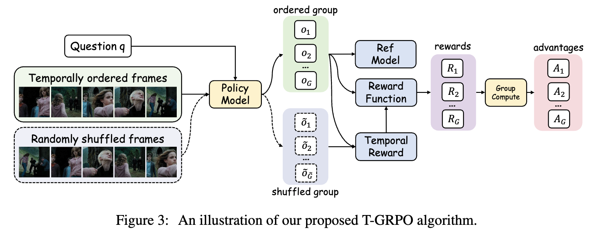
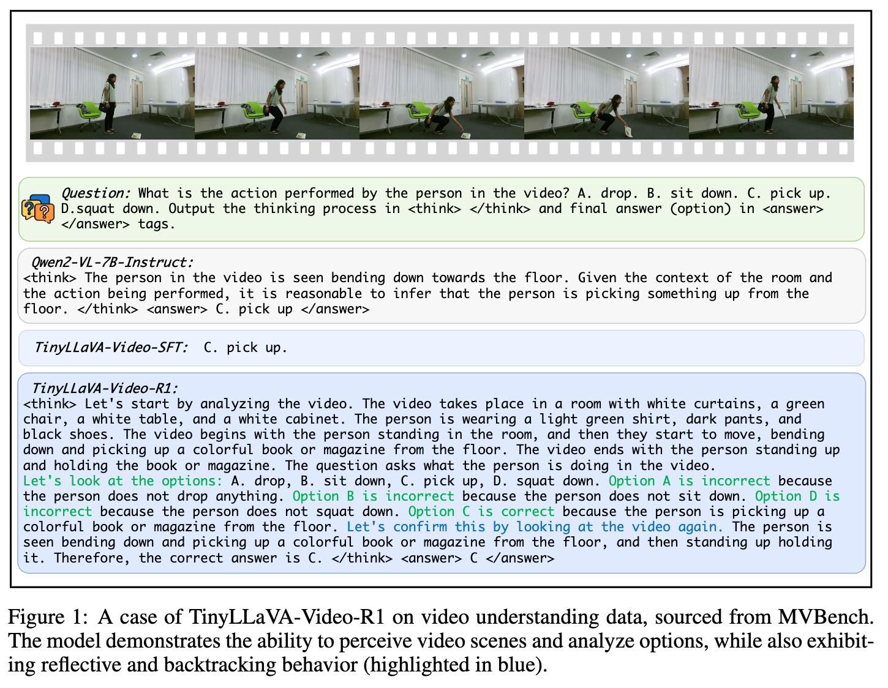
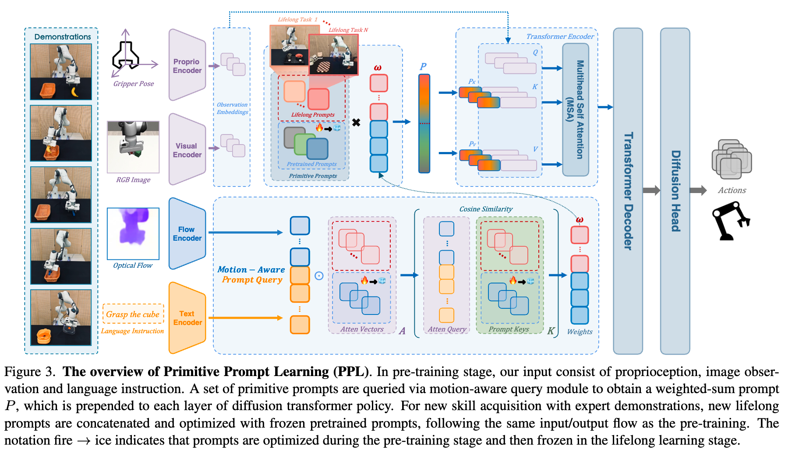
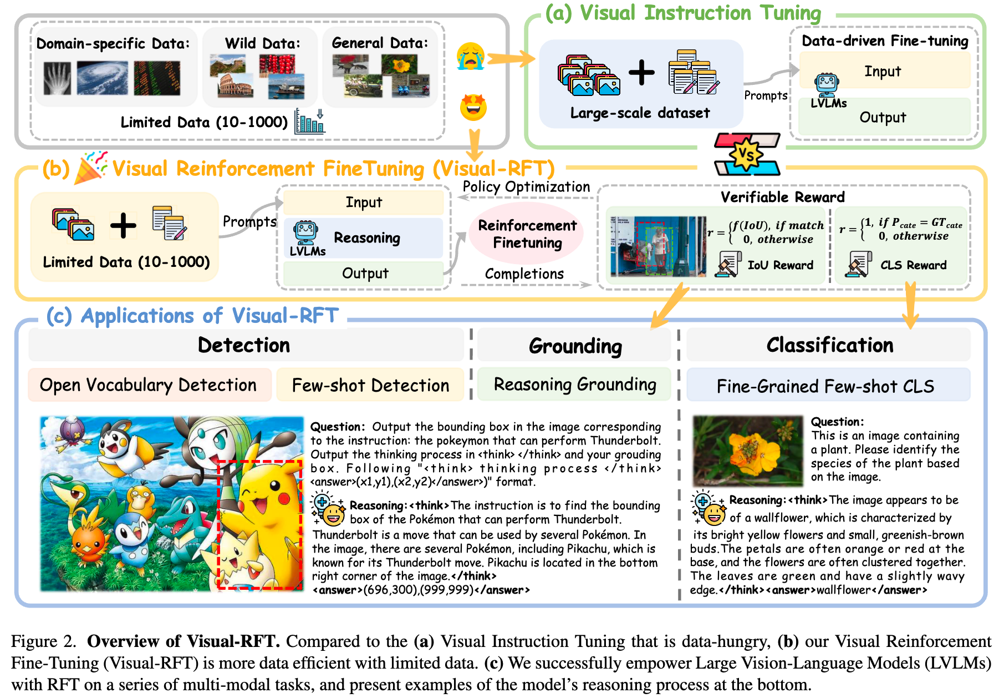
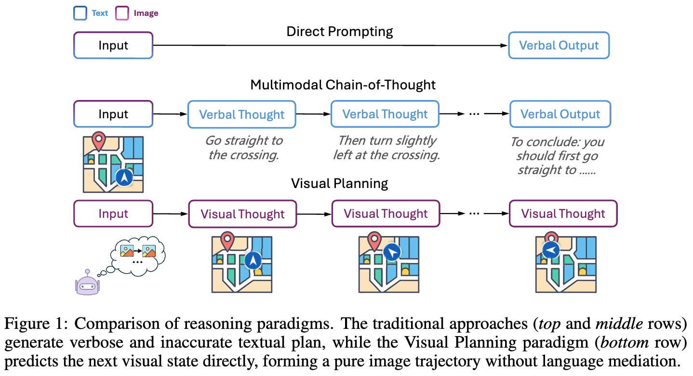
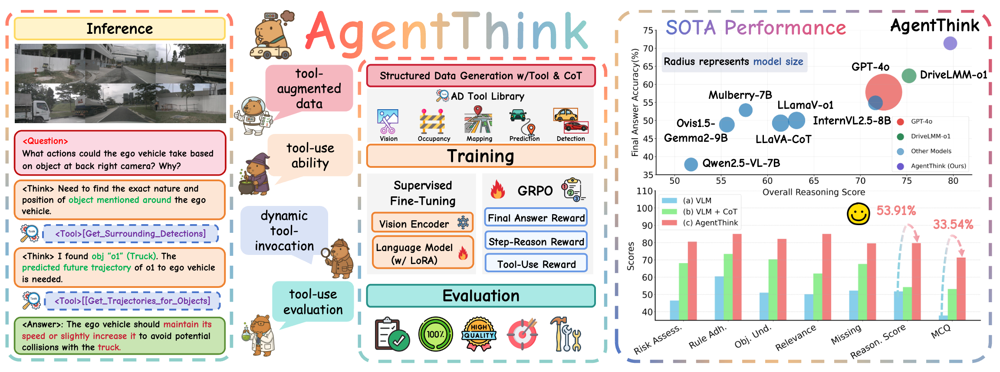

  

<h1 align="center">Awesome Thinking with PI (Perception & Interaction)</h1>

  <b>A curated list of resources on visual reasoning, video understanding, embodied AI, robot action, and perception-driven interaction.</b>

<!-- 顶部徽章区（Badges） -->

  
  
  

---

## 📚 Contents

- 🧠 [Reasoning as <think>](#reasoning-as-think)
- 🖼️ [Think with Images](#think-with-images)
- 🤖 [Embodied Intelligence (具身智能)](#具身智能)
- 🤝 [Contributing](#contributing)

---

  

---

## 🧠 Reasoning as &lt;think&gt;

---

### Open R1 Video

---

### Video-R1: Reinforcing Video Reasoning in MLLMs

---

### VideoChat-R1: Enhancing Spatio-Temporal Perception via Reinforcement Fine-Tuning

---

### TinyLLaVA-Video-R1: Towards Smaller LMMs for Video Reasoning

---

## 🖼️ Think with Images

<!-- 按同样卡片格式补充内容 -->

---

## 🤖 具身智能 (Embodied Intelligence)

---

### Embodied-Reasoner: Synergizing Visual Search, Reasoning, and Action for Embodied Interactive Tasks

---

### Reason-RFT: Reinforcement Fine-Tuning for Visual Reasoning

---

### Think Small, Act Big: Primitive Prompt Learning for Lifelong Robot Manipulation

---

### OpenFly: A Versatile Toolchain and Large-scale Benchmark for Aerial Vision-Language Navigation

---

### SAM-R1: Leveraging SAM for Reward Feedback in Multimodal Segmentation via RL

---

### Visual-RFT: Visual Reinforcement Fine-Tuning

---

### Visual Planning: Let's Think Only with Images

---

### AgentThink: A Unified Framework for Tool-Augmented Chain-of-Thought Reasoning in Vision-Language Models for Autonomous Driving

---

## 🤝 Contributing

Contributions are welcome! Please submit a pull request to add papers, code, or resources.

---

<!-- 快捷访问按钮区 -->

  
  
  
  
  

---

**Inspired by awesome-lists and the community’s effort on visual and embodied AI.**
