<h1 align="center">Awesome Thinking with PI (<u>P</u>erception & <u>I</u>nteraction)</h1>

  <b>A curated list of resources on visual reasoning, video understanding, embodied AI, robot action, and perception-driven interaction.</b>

<!-- Top badges -->

  
  
  
  

<!--  -->

## 📚 Contents

- 🤔 [Why We Need Thinking?](#why-we-need-thinking)
- 💭 [Thinking with Language](#thinking-with-language)
  - CoT / MCTS / RLHF
  - r1-like models
  - multimodal reasoning 
- 🔍 [Thinking with Images](#thinking-with-images)
  - GUI interaction / screen control / visual grounding
- 🌍 [Thinking in the Physical World](#thinking-in-the-physical-world)
  - Robotics / embodied navigation / manipulation
- 🛠️ [Tutorials and Tooling](#tutorials-and-tooling)
- 📖 [Related Collections](#related-collections)

---

## 🤔 Why We Need Thinking?

无论在人类视觉还是多模态模型里，感知给出的观测往往不完全、含噪且多解，可靠决策必须依赖跨时整合与假设检验——这就是“思考”。

**人类视觉的启示**

- **输入不完整**：瞬时感知零碎，二维到三维存在天然歧义，仅靠直接感知容易被错觉与遮挡误导。
- **预测—校正循环**：视觉依赖自上而下与自下而上的互动，通过假设生成、误差修正来抵御歧义。
- **跨时与主动控制**：稳健行为依赖跨时因果追踪、速度–准确性权衡，以及目标驱动的注意与资源分配。

**对应到多模态大模型**

- **多模态输入同样不全**：图像可能遮挡，语音含噪，文本歧义，模态间还可能互相冲突。
- **单次反应易偏差**：只依赖“快感知”容易被局部或错误线索牵引。
- **思考才能稳健**：跨模态/跨时间整合，假设比较与检验，风险下自适应调控，才能将嘈杂不全的感知转化为可靠决策。

**对应到视频异常检测:**
> 参见 [[LLM4VAD · Video Anomaly Detection]](./llm4vad/README.md)

### 可信视觉智能

可信并非仅来自“可解释性”，而是来自长期训练与真实世界的稳定表现（参见一次演讲中的比喻：我们信任陌生司机，多因可靠经验而非完全可解释的大脑机理）。

> Paraphrase from the [[talk]](https://www.youtube.com/watch?v=NA6EH8r-IT0): In response to a question about interpretability, Kaiming He asks—why do you trust a taxi driver you don't know? Not because the brain is fully interpretable, but because extensive real‑world training and testing make performance reliable; just like airplanes are trusted after millions of flights. Interpretability matters, yet reliability is ultimately earned through empirical evidence.

### Curiosity-driven Learning

Humans monitor learning progress in curiosity-driven exploration (Nature Communications 2021) [[paper](https://www.nature.com/articles/s41467-021-26196-w)]
发现人类在探索中会“盯着学习进度”本身：更偏好能带来更大知识增益/误差下降率的选择。行为与模型支持“以学习进步为回报”的好奇心机制

Curiosity-driven Exploration by Self-supervised Prediction (ICML 2017 (PMLR v70)) [[paper](https://proceedings.mlr.press/v70/pathak17a/pathak17a.pdf)]

Computational mechanisms of curiosity and goal-directed exploration (Neuroscience 2019) [[paper](https://elifesciences.org/articles/41703)]

#### 基本概念

Similar to how a human may think for a long time before responding to a difficult question, o1 uses a chain of thought when attempting to solve a problem. Through reinforcement learning, o1 learns to hone its chain of thought and refine the strategies it uses. It learns to recognize and correct its mistakes. It learns to break down tricky steps into simpler ones. It learns to try a different approach when the current one isn’t working. This process dramatically improves the model’s ability to reason.
与人类在回答难题之前可能会思考很长时间类似，o1 在尝试解决问题时也会使用思维链。通过强化学习，o1 可以学会磨练自己的思维链，并完善自己使用的策略。它学会识别和纠正错误。它学会把棘手的步骤分解成更简单的步骤。它学会在当前方法无效时尝试不同的方法。这一过程极大地提高了模型的推理能力。

利用 LLM 學習推理 — [OpenAI: Learning to Reason with LLMs](https://openai.com/zh-Hant/index/learning-to-reason-with-llms/)

Thinking with Images — [OpenAI](https://openai.com/index/thinking-with-images/)

##### 代表性工作

##### 观点文章

为何GRPO大放异彩DPO销声匿迹？
[WeChat article](https://mp.weixin.qq.com/s/b4OkzqfRcpFhPzTocwJatw)

---

## 💭 Thinking with Language
语言作为显式思维

Let’s Verify Step by Step (process supervision/PRM, OpenAI): 
过程奖励

Chain-of-Thought Prompting Elicits Reasoning in Large Language Models 

Tree of Thoughts: Deliberate Problem Solving with Large Language Models 

Graph of Thoughts: Solving Elaborate Problems with Large Language Models 

Automatic Chain of Thought Prompting in Large Language Models (ICLR 2023) 

Self-Consistency Improves Chain of Thought Reasoning in Language Models (ICLR 2023) 
多样化思路投票

Judging LLM-as-a-Judge with MT-Bench and Chatbot Arena (NeurIPS 2023 Datasets and Benchmarks Track) 

Wang Yifei et al., A Theoretical Understanding of Self-Correction through In-context Alignment, NeurIPS 2024.

### MCTS (Monte Carlo Tree Search, 蒙特卡洛树搜索)

这个是一个过渡，o1刚出的时候没有技术报告，社区猜测的实现方式，在deepseek-r1之后，大家都是grpo了～

社区早期常将 o1 的“长思考”理解为 ToT/MCTS 风格搜索；在 DeepSeek‑R1 之后，主流实现更多结合 GRPO/RFT 等强化学习方法以提升过程质量与稳定性。

LLaVA-CoT — 逐步思维链用于多模态过程监督 

**Timeline of o1-style releases**

|              | Sep 12 | Oct 09 | Nov 04 | Nov 15 | Nov 16 | Nov 20 | Nov 25 | Nov 28 |
|--------------|------------|------------|------------|------------|------------|------------|------------|------------|
| Release      | OpenAI o1  | O1-Journey | LLaMA-O1   | LLaVA-CoT  | K0-math    | DeepSeek-R1| InternThinker | QwQ      |
| Organization | OpenAI     | SJTU       | Shanghai AI Lab | PKU     | Moonshot AI | DeepSeek  | Shanghai AI Lab | Alibaba Group |

[A] Xu Guowei et al., LLaVA-CoT: Let Vision Language Models Reason Step-by-Step, in arXiv, 2024.

### R1-Style Reasoning Models Overview (As of March)

Note: The following table compiles notable r1-style models and resources.
这里只列三月份的，基本都是相对领域的首次工作，后续的比较多，代表性工作以卡片形式呈现。

<!-- table begins -->

| Model | Foundational LLMs | Time | Institution | Task | Feature |
|-------|------------------|------|-------------|------|---------|
| Deepseek-R1-Zero  | Deepseek-V3-671B | Jan 22, 2025 | DeepSeek-AI | Generic | - |
| Open-R1  | Qwen2.5-1.5B-Instruct | Jan 24, 2025 | HuggingFace | Generic | - |
| Multimodal-Open-R1  | Qwen2-VL-2B/7B-Instruct | Jan 27, 2025 | LMMs-Lab | Generic | - |
| R1-V  | Qwen2-VL-2B-Instruct | Feb 2, 2025 | Deep Agent | Math | - |
| VLM-R1  | Qwen2.5-VL-3B/7B | Feb 3, 2025 | Zhejiang University | Object Detection | - |
| MedVLM-R1 | Qwen2-VL-2B | Feb 26, 2025 | Technical University of Munich | Medical Image Analysis | - |
| R1-Omni  | HumanOmni-0.5B | Mar 7, 2025 | Chinese Academy of Sciences | Generic | - |
| MM-Eureka-Zero | InternVL2.5-Pretrained-8B | Mar 7, 2025 | Shanghai AI Lab | Math | - |
| VisualThinker-R1-Zero  | Qwen2-VL-2B | Mar 7, 2025 | University of California | Math | "Aha Moment" on a 2B Non-SFT Model |
| Seg-Zero  | Qwen2.5-VL-3B + SAM2 | Mar 9, 2025 | CUHK | Segmentation | - |
| Vision-R1  | Qwen-2.5-VL-72B | Mar 9, 2025 | Zhejiang University | Math | - |
| MM-Eureka | InternVL2.5-Instruct-8B | Mar 10, 2025 | Shanghai AI Laboratory | Math | Leave-One-Out, RLOO |
| [LMM-R1](https://github.com/thu-SLT-Lab/LMM-R1)   | Qwen2.5-VL-Instruct-3B | Mar 10, 2025 | Southeast University | Math, ScienceQA, ChartQA | Game Planning, PPO |
| Curr-ReFT | Qwen2.5-VL-3B | Mar 10, 2025 | USTC | Detection/Classification/Math | - |
| AlphaDrive | Qwen2VL-2B | Mar 10, 2025 | HUST | Autonomous driving | - |
| DriveLMM-o1  | InternVL2.5-8B | Mar 13, 2025 | MBZUAI | Autonomous driving | - |
| R1-OneVision  | Qwen2.5-VL-7B-Instruct | Mar 13, 2025 | Zhejiang University | Math/General/Science/Chart | Formal Description |
| R1-VL  | Qwen2-VL-7B | Mar 17, 2025 | NYTU | Math | Step-wise Reward |
| OpenVLThinker  | Qwen2.5-VL-7B-Instruct | Mar 21, 2025 | University of California | Math | - |
| Easy-R1 | Qwen2.5-VL | Mar 21, 2025 | Beihang University | Math | Efficient, Scalable |
| Safe RLHF-V | Qwen2-VL-7B | Mar 22, 2025 | Peking University | Multimodal Safety | - |
| Video-R1  | Qwen2.5-VL-7B | Mar 27, 2025 | CUHK | Video Reasoning | - |
| Open-R1-Video  | Qwen2-VL-7B | Mar 27, 2025 | CUHK | Video Understanding | - |
| Embodied-Reasoner  | Qwen2-VL-7B | Mar 27, 2025 | Zhejiang University | Embodied Interactive | Observation–Thought–Action |
| UI-R1 | Qwen2.5-VL-3B | Mar 27, 2025 | vivo AI Lab | Action Prediction of GUI Agents | - |
| Q-Insight  | Qwen-2.5-VL-7B | Mar 28, 2025 | Peking University | Image Quality Assessment | - |

Note: A small GitHub badge next to a model name links to its confirmed repository. If no badge is shown, the official repo is pending or unverified.

<!-- Legend removed as Modality column was dropped -->

<!-- table ends -->

### Thinking across Modalities

这里单独列出来主要考虑视觉感知，虽然前面也有,

让“思维链”跨越文本与视觉（图像/视频/图表等），通过GRPO/DPO/RLHF与过程监督，提升跨模态理解与推理。

#### 评估基准

- MM-Eureka / MM-Eureka-Zero — 留一法与RLOO强化样式 [示例](https://github.com/ShanghaiAILab/MM-Eureka)

### 目标检测/分割

https://github.com/om-ai-lab/VLM-R1

#### Visual-RFT: Visual Reinforcement Fine-Tuning (ICCV 2025)

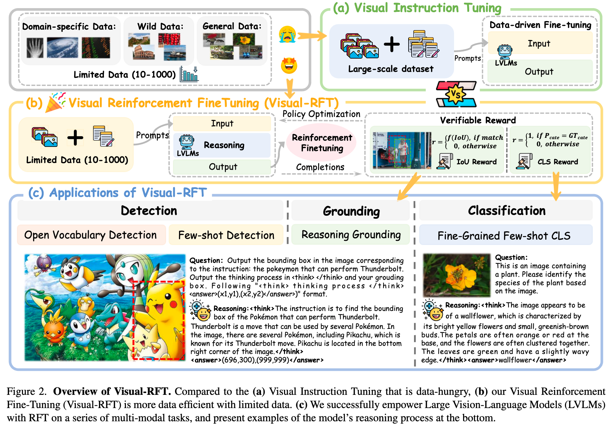

#### SAM-R1: Leveraging SAM for Reward Feedback in Multimodal Segmentation via RL

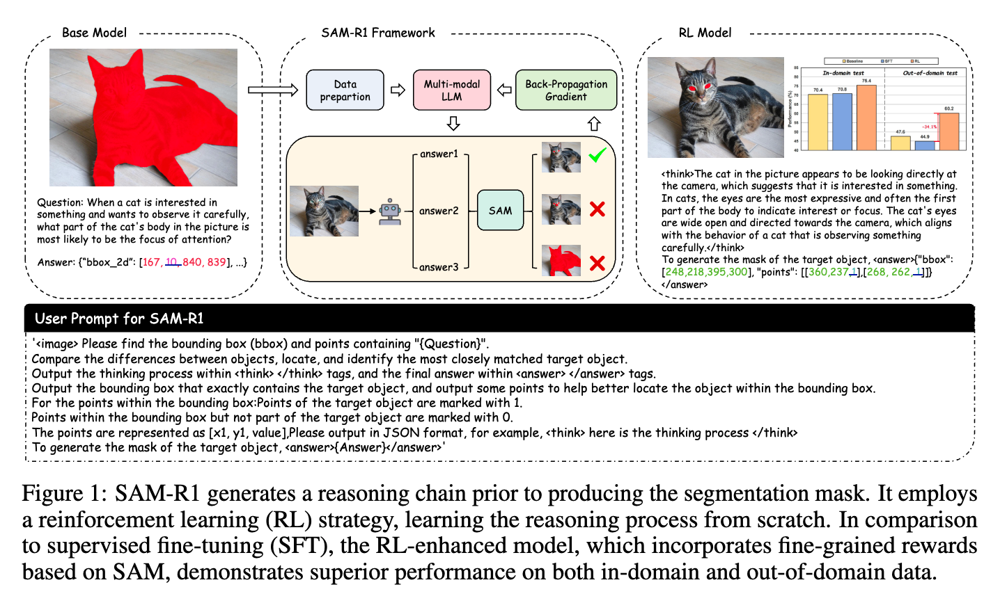

---

### 视频理解 

#### Video-R1: Reinforcing Video Reasoning in MLLMs
强化视频时空推理 

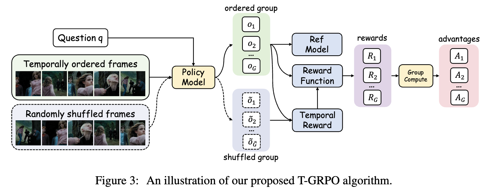

#### VideoChat-R1: Enhancing Spatio-Temporal Perception via Reinforcement Fine-Tuning
时空感知强化微调

 

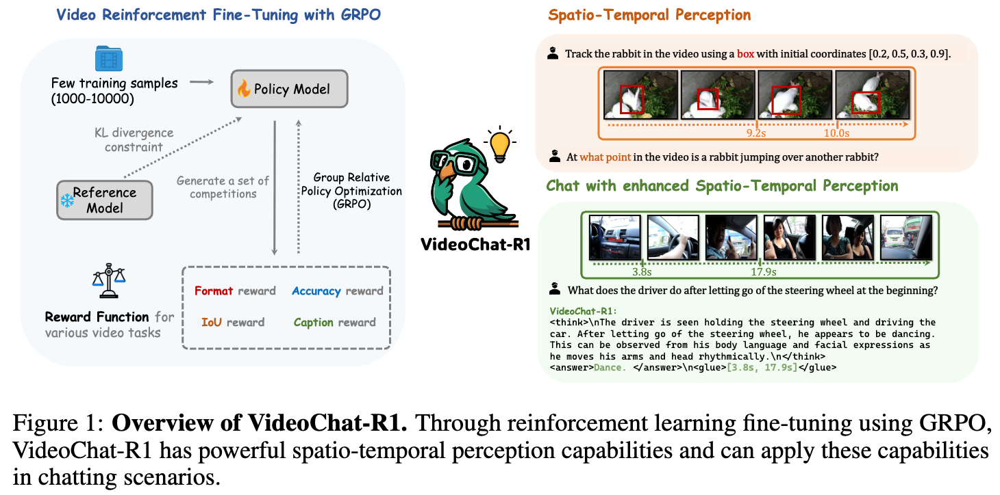

#### TinyLLaVA-Video-R1: Towards Smaller LMMs for Video Reasoning
小参数视频推理

### 其他模态（事件相机,3D,红外）

### 可信安全

- Safe RLHF-V — 多模态安全对齐 [项目](https://github.com/PKU-Alignment/Safe-RLHF-V)

> 小结：多模态“思维—搜索—验证”闭环正在标准化，核心在于过程监督（PRM）、行为奖励与环境校验相结合。

## 🖼️ Thinking with Images 

### 理论部分

从语言空间到像素空间

### 为什么要用工具

### 早期工作
**思维+行动的交替（检索/工具使用）(2023)**

ReAct: Synergizing Reasoning and Acting in Language Models 
<kbd>ICLR 2023</kbd> 

Program of Thoughts Prompting: Disentangling Computation from Reasoning for Numerical Reasoning Tasks (TMLR 2023) 

Toolformer: Language Models Can Teach Themselves to Use Tools 
自动学习何时用工具

TOOLLLM: Facilitating Large Language Models to Master 16000+ Real-World APIs 
<kbd>ICLR 2024</kbd> 

DSPy/可编排思维：声明式地组合推理模块与检索/工具 — 

Zhao Andrew et al., ExpeL: LLM Agents Are Experiential Learners, AAAI 2024.

- Number it: Temporal Grounding Videos like Flipping Manga [arXiv](https://arxiv.org/pdf/2411.10332)

### region-focus (non-RLHF)

LSNet: See Large, Focus Small  

A Stitch in Time Saves Nine: Small VLM is a Precise Guidance for accelerating Large VLMs (CVPR 2025) 

**VLsI**: **V**erbalized **L**ayer**s**-to-**I**nteractions from Large to Small Vision Language Models  

Boltzmann Attention Sampling for Image Analysis with Small Objects (CVPR 2025)  

### Image Manipulation

**Instruction-Guided Visual Masking** [[paper](https://arxiv.org/pdf/2405.19783)] [[code](https://github.com/2toinf/IVM)]

Plug-and-play module: mask irrelevant regions to enable better understanding by large models.

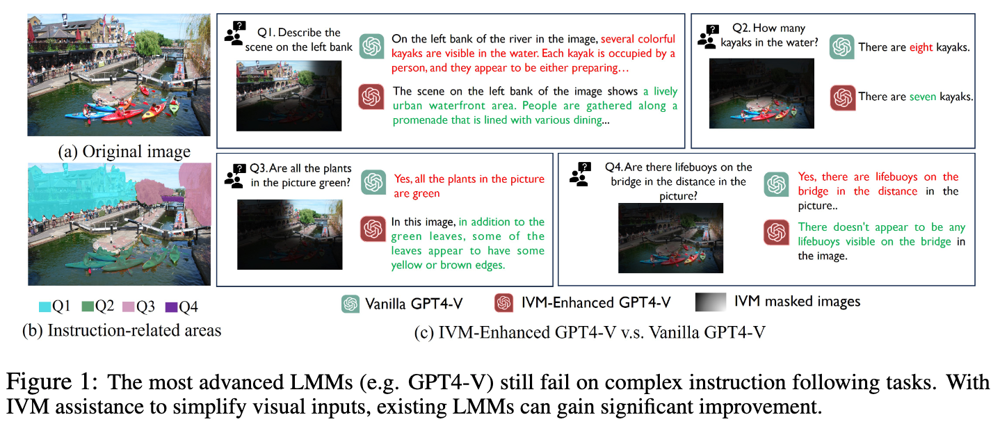

**COGCOM: A VISUAL LANGUAGE MODEL WITH CHAIN-OF-MANIPULATIONS REASONING** [[paper](https://arxiv.org/pdf/2402.04236)] [[code](https://github.com/THUDM/CogCoM)]

Chain of manipulations; intrinsic operations (e.g., locate, zoom) that produce intermediate outputs (e.g., bounding boxes, image patches).

Number it: Temporal Grounding Videos like Flipping Manga (CVPR 2025) 

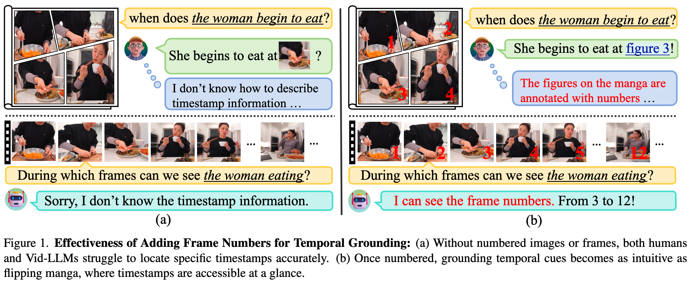

### 使用图像思考
 

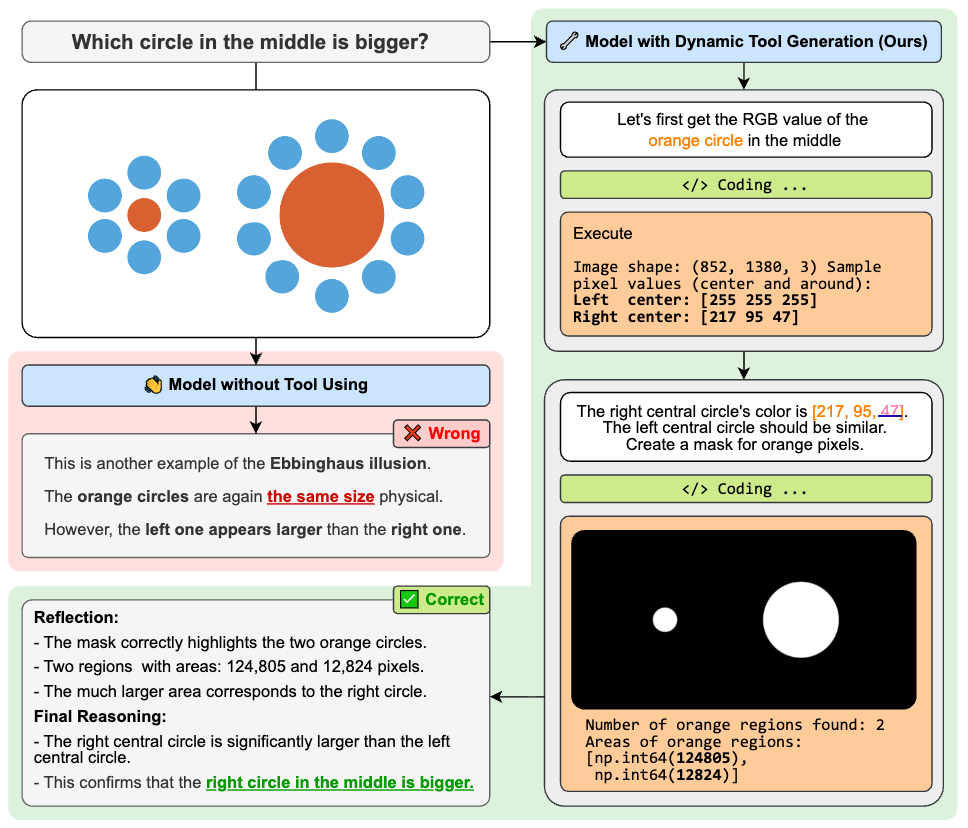

---
### 图像生成

#### Visual Planning: Let's Think Only with Images

   

#### GRIT: Teaching MLLMs to Think with Images

Highlight: 以视觉为中介的“图像思考”范式解读与科普。

#### d1: Scaling Reasoning in Diffusion Large Language Models via Reinforcement Learning (arXiv 2025)

Highlight: 将强化学习用于扩散式大模型，提升复杂推理能力。

#### DanceGRPO (Text-to-Image)

Highlight: 面向文生图的 GRPO 训练与策略实现。

#### Flow-GRPO (Text-to-Image)

Highlight: 基于 Flow/扩散流程的 GRPO 训练范式与实践。

#### T2I-R1 (Text-to-Image)

Highlight: 将 R1 式逐步推理/奖励思路引入文本到图像生成。

### GUI 代理与屏幕操作
- UI-R1 — 图形界面智能体动作预测 [项目](https://github.com/vivo-ai-lab/UI-R1)
- Qwen-Agent — 工具增强与GUI自动化生态 [项目](https://github.com/QwenLM/Qwen-Agent/tree/main)

### 视觉操作（Zoom/Locate/Segment）
- CogCoM（Chain-of-Manipulations） [arXiv](https://arxiv.org/pdf/2402.04236) · [代码](https://github.com/THUDM/CogCoM)
- Instruction-Guided Visual Masking [arXiv](https://arxiv.org/pdf/2405.19783) · [代码](https://github.com/2toinf/IVM)
- EntitySeg Toolbox（开放世界分割） [代码](https://github.com/qqlu/Entity)

### 视觉操作
VisualToolAgent (VisTA): A Reinforcement Learning Framework for Visual Tool Selection

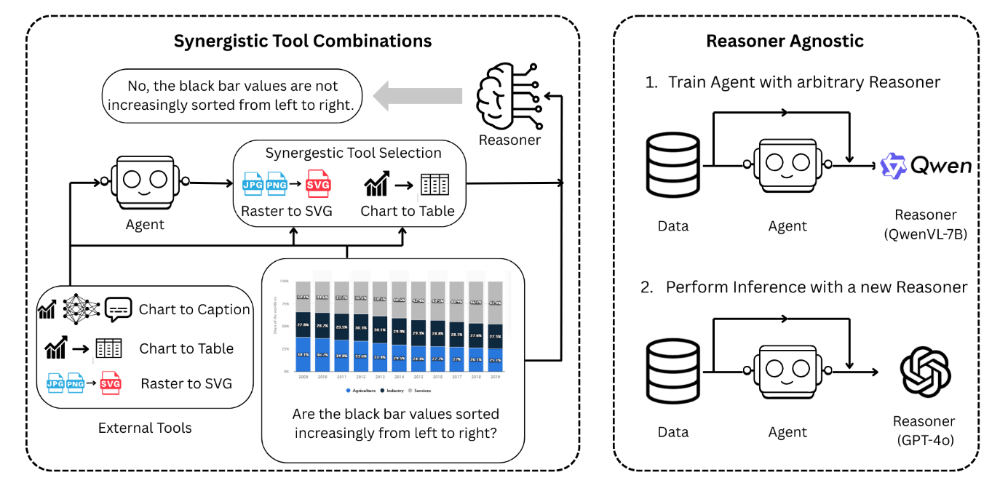

## 🤖 Thinking in the Physical World

Embodied-R1: Reinforced Embodied Reasoning for General Robotic Manipulation

#### Embodied-Reasoner: Synergizing Visual Search, Reasoning, and Action for Embodied Interactive Tasks

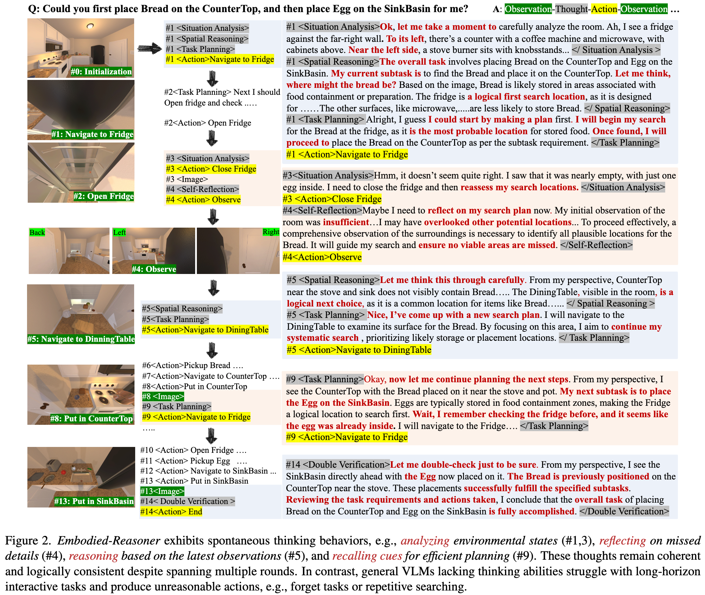

---

#### Reason-RFT: Reinforcement Fine-Tuning for Visual Reasoning

---

#### Think Small, Act Big: Primitive Prompt Learning for Lifelong Robot Manipulation

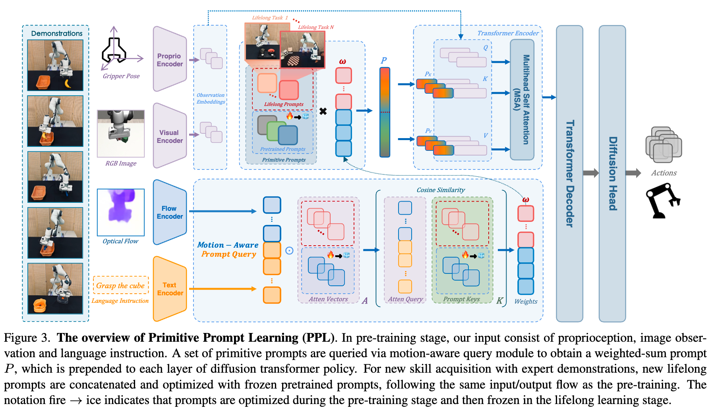

---

#### OpenFly: A Versatile Toolchain and Large-scale Benchmark for Aerial Vision-Language Navigation

---

#### AgentThink: A Unified Framework for Tool-Augmented Chain-of-Thought Reasoning in Vision-Language Models for Autonomous Driving

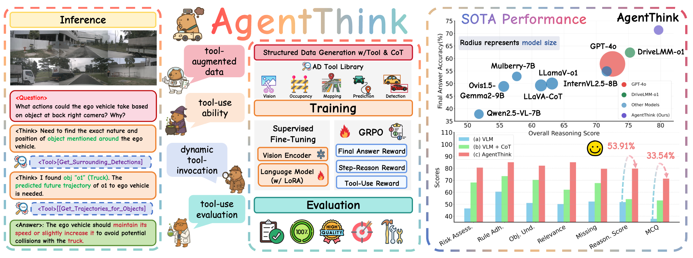

---

## 🛠️ Tutorials and Tooling

### 强化学习算法
卡片化汇总主流/新近的对齐与策略优化方法，统一展示 arXiv / 官方链接 / 代码。

#### DPO: Direct Preference Optimization (arXiv 2023)

Highlight: 直接在偏好数据上拟合概率偏序，避免显式奖励建模。

#### Agentic Reinforced Policy Optimization (ARPO, arXiv 2025)

Highlight: 面向智能体交互的强化对齐策略优化，聚焦多阶段推理质量。

#### GAPO: Learning Preferential Prompt through Generative Adversarial Policy Optimization (ACL 2025)
 

Highlight: 生成式对抗 + 偏好信号联合，提升提示学习与策略稳定性。

#### PAPO: Perception-Aware Policy Optimization for Multimodal Reasoning

Highlight: 针对 GRPO 的改进方法（稳定性 / 收敛效率）。

#### TreePO: Bridging Policy Optimization and Inference Efficiency (arXiv 2025)

Highlight: 引入树式启发结构，兼顾对齐效果与推理效率。

#### RuleReasoner: Reinforced Rule-based Reasoning via Domain-aware Dynamic Sampling (arXiv 2025)
 

Highlight: 结合领域规则动态采样与强化优化，提高结构化推理质量与可控性。

---
### 操作实现

 — R1 训练与复现的简洁模板。

 — 通用多模态 R1。

 — 视觉-语言逐步奖励。

 — 开源视频 R1 范式。

 — RL 工具与代理训练框架。

## 📖 Related Collections

 — From Language to Action: A Review of Large Language Models as Autonomous Agents and Tool Users 

 — System‑2 agents, tool‑use, and planning resources.

 — Compute/data‑efficient reasoning methods and benchmarks.

 — Visual-only reasoning with images (papers + code).

 — Broad visual thinking and perception resources.

 — Reasoning with generated intermediate images (papers + code).

