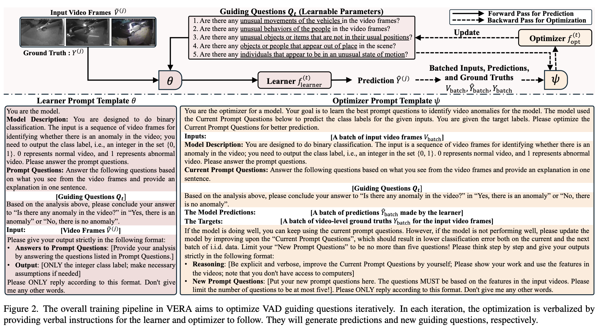
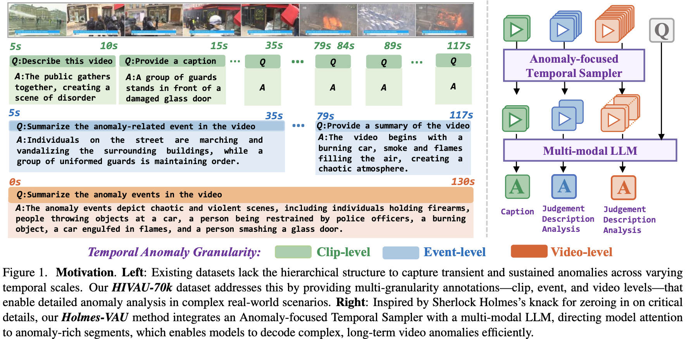
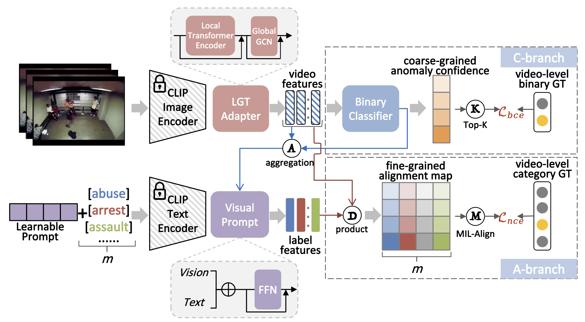
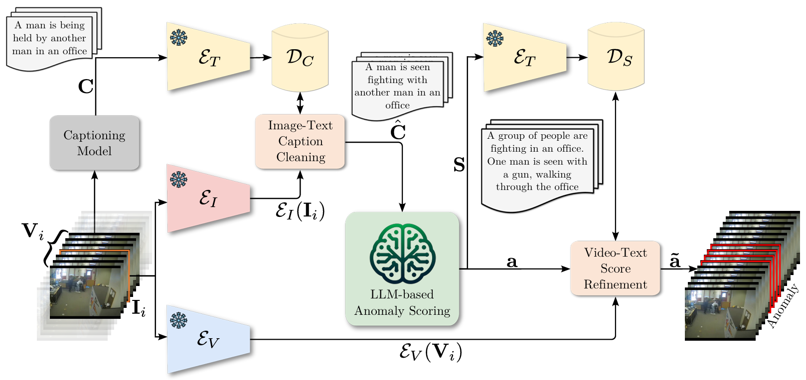
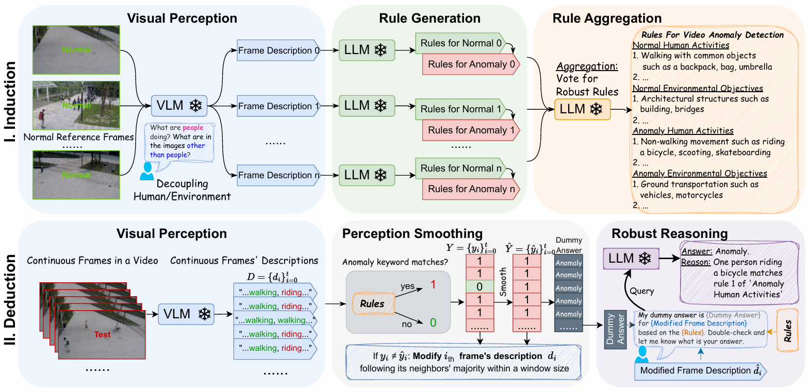
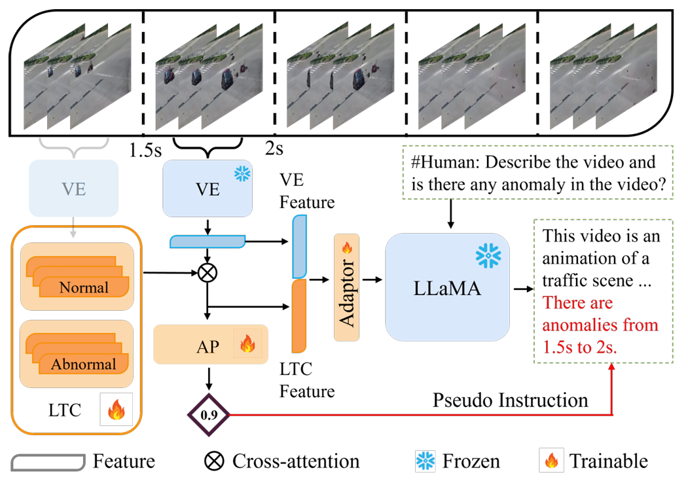
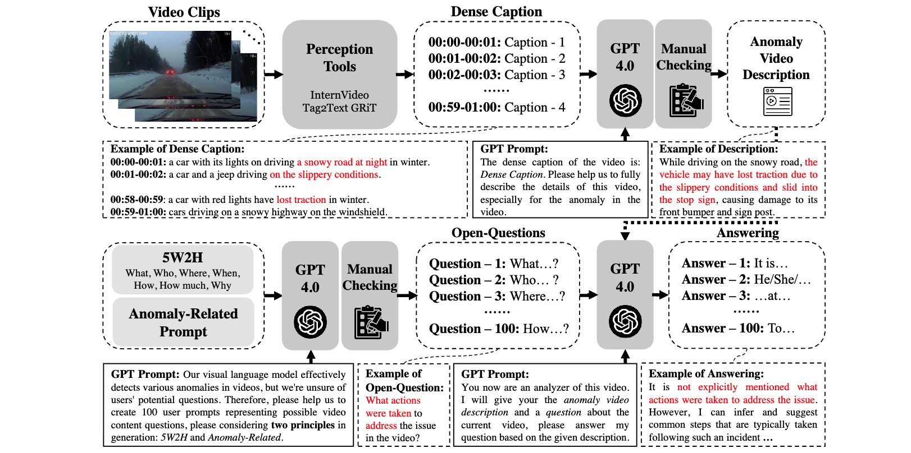

# Awesome LLM4VAD

A curated list of papers and resources on Large Language Models for Video Anomaly Detection (VAD).

## Contents

- [Overview](#overview)
- [Papers (2025)](#papers-2025)
- [Papers (2024)](#papers-2024)
- [Contributing](#contributing)
- [License and Credits](#license-and-credits)

---

## Overview

This list collects representative works that leverage LLMs or vision-language models for video anomaly detection, explanation, and understanding. Entries are grouped by year with links to paper and code, plus a preview figure when available.

---

## Papers (2025)

### VERA: Explainable Video Anomaly Detection via Verbalized Learning of Vision-Language Models (CVPR 2025)

Highlight: Verbalized learning makes VLM-based VAD explainable with natural-language rationales and clearer decision traces.

---

### Holmes-VAU: Towards Long-term Video Anomaly Understanding at Any Granularity (CVPR 2025)

Highlight: Targets long-horizon anomaly understanding with fine-to-coarse granularity, improving temporal coverage and robustness.

---

## Papers (2024)

### VadCLIP: Adapting Vision-Language Models for Weakly Supervised Video Anomaly Detection (AAAI 2024)

Highlight: Adapts CLIP-style vision–language alignment to weakly supervised VAD, reducing annotation demands.

---

### Harnessing Large Language Models for Training-free Video Anomaly Detection (CVPR 2024)

Highlight: Leverages LLM priors for training-free anomaly detection via promptable semantic knowledge.

---

### Follow the Rules: Reasoning for Video Anomaly Detection with Large Language Models (ECCV 2024)

Highlight: Injects rule-based reasoning with LLMs to guide anomaly decisions and improve interpretability.

---

### Video Anomaly Detection and Explanation via Large Language Models (arXiv 2024)

Highlight: Couples VAD with LLM-generated explanations to provide interpretable, text-based rationales.

---

### HAWK: Learning to Understand Open-World Video Anomalies (NeurIPS 2024)

Highlight: Pursues open-world anomaly understanding with scalable concept coverage and out-of-distribution robustness.

---

