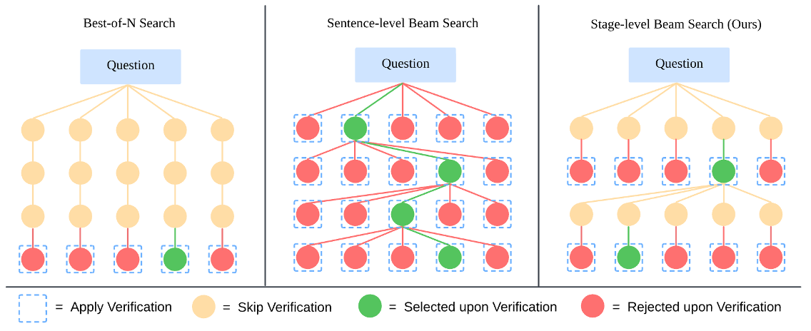

<h1 align="center">Awesome Thinking with PI (<u>P</u>erception & <u>I</u>nteraction)</h1>

  <b>A curated list of resources on visual reasoning, video understanding, embodied AI, robot action, and perception-driven interaction.</b>

<!-- Top badges -->

  
  
  
  

## 📚 Contents

- 🤔 [Why We Need Thinking?](#why-we-need-thinking)
- 💭 [Thinking with Language](#thinking-with-language-symbolic-level)
  - CoT / ToT / GoT
  - r1-like reasoning models
- 🌉 [Thinking across Modalities](#thinking-across-modalities-multimodal-level)
  - PPO / DPO / GRPO
  - RLHF for multimodal reasoning
- 🔍 [Thinking with Visual Operations](#thinking-with-visual-operations-interactive-level)
  - GUI interaction / screen control / visual grounding
- 🌍 [Thinking in the Physical World](#thinking-in-the-physical-world-embodied-level)
  - Robotics / embodied navigation / manipulation
- 🛠️ [Tutorials and Tooling](#tutorials-and-tooling)
- 📖 [Related Collections](#related-collections)

---

## 🤔 Why We Need Thinking?

无论在人类视觉还是多模态模型里，感知给出的观测往往不完全、含噪且多解，可靠决策必须依赖跨时整合与假设检验——这就是“思考”。

### 人类视觉的启示

- 输入不完整：瞬时感知零碎，二维到三维存在天然歧义，仅靠直接感知容易被错觉与遮挡误导。
- 预测—校正循环：视觉依赖自上而下与自下而上的互动，通过假设生成、误差修正来抵御歧义。
- 跨时与主动控制：稳健行为依赖跨时因果追踪、速度–准确性权衡，以及目标驱动的注意与资源分配。

### 对应到多模态大模型

- 多模态输入同样不全：图像可能遮挡，语音含噪，文本歧义，模态间还可能互相冲突。
- 单次反应易偏差：只依赖“快感知”容易被局部或错误线索牵引。
- 思考才能稳健：跨模态/跨时间整合，假设比较与检验，风险下自适应调控，才能将嘈杂不全的感知转化为可靠决策。

### 对应到视频异常检测

参见专题整理：[LLM4VAD · Video Anomaly Detection](../llm4vad/README.md)

上下文依赖（复杂性）：异常往往是长时序事件（打斗、事故），需要结合前后因果与场景关系才能正确判定。

歧义混淆（模糊性）：局部行为或场景容易与异常混淆（奔跑 vs 逃跑、聚集 vs 暴乱），必须通过更长时序和多模态线索来消解。

长尾分布（稀疏性）：异常在视频流中出现频率极低、时机不可控，单次观测易漏检，必须跨时累积证据与假设检验。

#### 其实“思考”并不是只在异常场景里才需要，而是在异常问题上，它的必要性被放大：

常态模式容易靠感知解决：正常行为/场景占据绝大多数，规律性强、数据量大，单靠感知模式匹配就能达到不错的效果。

异常本质上是“不确定”：异常往往稀疏、少样本，缺乏先验统计支撑。仅靠快速感知会出现偏差，需要跨时整合和假设检验来弥补。

异常涉及更大风险：一旦误判，可能带来严重后果（漏报安全事件、误报干扰系统），因此必须引入更慢、更稳健的决策机制。

异常往往打破常规：它们可能表现为复杂的上下文依赖、模糊的语义混淆、长尾的稀疏分布——这些都恰好是“思考”擅长处理的。

我们需要的是推理，而不仅是事后解释。

注：可信并非仅来自“可解释性”，而是来自长期训练与真实世界的稳定表现（参见一次演讲中的比喻：我们信任陌生司机，多因可靠经验而非完全可解释的大脑机理）。

Why Would You Trust the Human Driver?

> Paraphrase from the [[talk]](https://www.youtube.com/watch?v=NA6EH8r-IT0): In response to a question about interpretability, Kaiming He asks—why do you trust a taxi driver you don't know? Not because the brain is fully interpretable, but because extensive real‑world training and testing make performance reliable; just like airplanes are trusted after millions of flights. Interpretability matters, yet reliability is ultimately earned through empirical evidence.

### 基本概念

Similar to how a human may think for a long time before responding to a difficult question, o1 uses a chain of thought when attempting to solve a problem. Through reinforcement learning, o1 learns to hone its chain of thought and refine the strategies it uses. It learns to recognize and correct its mistakes. It learns to break down tricky steps into simpler ones. It learns to try a different approach when the current one isn’t working. This process dramatically improves the model’s ability to reason.
与人类在回答难题之前可能会思考很长时间类似，o1 在尝试解决问题时也会使用思维链。通过强化学习，o1 可以学会磨练自己的思维链，并完善自己使用的策略。它学会识别和纠正错误。它学会把棘手的步骤分解成更简单的步骤。它学会在当前方法无效时尝试不同的方法。这一过程极大地提高了模型的推理能力。

利用 LLM 學習推理 — [OpenAI: Learning to Reason with LLMs](https://openai.com/zh-Hant/index/learning-to-reason-with-llms/)

Thinking with Images — [OpenAI](https://openai.com/index/thinking-with-images/)

### 参考与理论支撑

- Wang Yifei et al., A Theoretical Understanding of Self-Correction through In-context Alignment, NeurIPS 2024.
- Zhang Zhuosheng et al., Automatic Chain of Thought Prompting in Large Language Models, ICLR 2023.
- Zhao Andrew et al., ExpeL: LLM Agents Are Experiential Learners, AAAI 2024.

---

## 💭 Thinking with Language (Symbolic-level)

一句话概览：以“语言”为显式中间层，把复杂任务拆成步骤→在思维空间搜索→调用工具校验→用评审与过程监督持续改进。

> Quick recipe: CoT → Self-Consistency/ToT → ReAct+Tools → Judge/Refine → PRM/DPO.

2022：语言成为“可见思维”

Let’s Verify Step by Step (process supervision/PRM): [arXiv:2305.20050](https://arxiv.org/abs/2305.20050)

- Chain-of-Thought（CoT）：示例引导逐步推理 — Chain-of-Thought Prompting Elicits Reasoning in Large Language Models [arXiv:2201.11903](https://arxiv.org/abs/2201.11903)
- Self-Consistency：多样化思路投票 — Self-Consistency Improves Chain of Thought Reasoning in Language Models [arXiv:2203.11171](https://arxiv.org/abs/2203.11171)
- STaR：用模型生成的推理链反蒸馏训练 — STaR: Bootstrapping Reasoning with Reasoning [arXiv:2203.14465](https://arxiv.org/abs/2203.14465)
- Least-to-Most：先分解再求解 — Least-to-Most Prompting Enables Complex Reasoning in Large Language Models [arXiv:2210.00720](https://arxiv.org/abs/2210.00720)
- Program-of-Thought：把思维转为可执行程序 — Program of Thoughts Prompting: Disentangling Computation from Reasoning for Numerical Reasoning Tasks [arXiv:2211.12588](https://arxiv.org/abs/2211.12588)

2023：从“写出思路”到“搜索与执行”

- ReAct：思维+行动的交替（检索/工具使用） — ReAct: Synergizing Reasoning and Acting in Language Models [arXiv:2210.03629](https://arxiv.org/abs/2210.03629)
- Toolformer/Function Calling：自动学习何时用工具 — Toolformer: Language Models Can Teach Themselves to Use Tools [arXiv:2302.04761](https://arxiv.org/abs/2302.04761)
- PAL/PoT：将思维转为可执行程序/代码求解 — PAL: Program-aided Language Models [arXiv:2211.10435](https://arxiv.org/abs/2211.10435)；Program of Thoughts Prompting [arXiv:2211.12588](https://arxiv.org/abs/2211.12588)
- Tree/Graph of Thoughts：在思维空间进行树/图搜索与评估 — Tree of Thoughts [arXiv:2305.10601](https://arxiv.org/abs/2305.10601)；Graph of Thoughts [arXiv:2308.09687](https://arxiv.org/abs/2308.09687)
- Self-Refine/Reflexion：自我反馈与反思改进 — Self-Refine [arXiv:2303.17651](https://arxiv.org/abs/2303.17651)；Reflexion [arXiv:2303.11366](https://arxiv.org/abs/2303.11366)
- LLM-as-a-Judge：用模型评审模型输出，支撑自监督与对比优化（DPO） — LLM-as-a-Judge [arXiv:2306.05685](https://arxiv.org/abs/2306.05685)；DPO [arXiv:2305.18290](https://arxiv.org/abs/2305.18290)

*注：Tree/Graph of Thoughts、MCTS、ReAct 交互式搜索。*

2024：面向“过程质量”的训练与验证

- 过程监督与PRM（Process Reward Model）：奖励“思路过程”的正确性 — 代表作：Let’s Verify Step by Step [arXiv:2305.20050](https://arxiv.org/abs/2305.20050)
- RLAIF/合成反馈：用AI或规则提供对齐信号 — Constitutional AI: Harmlessness from AI Feedback [arXiv:2212.08073](https://arxiv.org/abs/2212.08073)
- 强化“思维—搜索—验证”闭环：把CoT与MCTS/工具调用/校验器结合
- DSPy/可编排思维：声明式地组合推理模块与检索/工具 — [GitHub: stanfordnlp/dspy](https://github.com/stanfordnlp/dspy)

2025：

- Supervision（监督/训练）：从答案监督走向过程监督（STaR、DPO、PRM、RLAIF、过程奖励）
- Simulation（工具/程序）：语言驱动外部工具与程序运行（Toolformer、Function Calling、PAL、代码/求解器）
- Society（社会化协作）：多智能体/辩论/评审（Debate、LLM-as-a-Judge、Self-Refine/Reflexion）

### MCTS

Timeline of o1-style releases (horizontal)

|              | Sep 12 | Oct 09 | Nov 04 | Nov 15 | Nov 16 | Nov 20 | Nov 25 | Nov 28 |
|--------------|------------|------------|------------|------------|------------|------------|------------|------------|
| Release      | OpenAI o1  | O1-Journey | LLaMA-O1   | LLaVA-CoT  | K0-math    | DeepSeek-R1| InternThinker | QwQ      |
| Organization | OpenAI     | SJTU       | Shanghai AI Lab | PKU     | Moonshot AI | DeepSeek  | Shanghai AI Lab | Alibaba Group |

[A] Xu Guowei et al., LLaVA-CoT: Let Vision Language Models Reason Step-by-Step, in arXiv, 2024.

### R1-Style Reasoning Models Overview

Note: The following table compiles notable r1-style models and resources.
<!-- table begins -->

| Model | Foundational LLMs | Time | Institution | Task | Feature |
|-------|------------------|------|-------------|------|---------|
| Deepseek-R1-Zero  | Deepseek-V3-671B | Jan 22, 2025 | DeepSeek-AI | Generic | - |
| Open-R1  | Qwen2.5-1.5B-Instruct | Jan 24, 2025 | HuggingFace | Generic | - |
| Multimodal-Open-R1  | Qwen2-VL-2B/7B-Instruct | Jan 27, 2025 | LMMs-Lab | Generic | - |
| R1-V  | Qwen2-VL-2B-Instruct | Feb 2, 2025 | Deep Agent | Math | - |
| VLM-R1  | Qwen2.5-VL-3B/7B | Feb 3, 2025 | Zhejiang University | Object Detection | - |
| MedVLM-R1 | Qwen2-VL-2B | Feb 26, 2025 | Technical University of Munich | Medical Image Analysis | - |
| R1-Omni  | HumanOmni-0.5B | Mar 7, 2025 | Chinese Academy of Sciences | Generic | - |
| MM-Eureka-Zero | InternVL2.5-Pretrained-8B | Mar 7, 2025 | Shanghai AI Lab | Math | - |
| VisualThinker-R1-Zero  | Qwen2-VL-2B | Mar 7, 2025 | University of California | Math | "Aha Moment" on a 2B Non-SFT Model |
| Seg-Zero  | Qwen2.5-VL-3B + SAM2 | Mar 9, 2025 | CUHK | Segmentation | - |
| Vision-R1  | Qwen-2.5-VL-72B | Mar 9, 2025 | Zhejiang University | Math | - |
| MM-Eureka | InternVL2.5-Instruct-8B | Mar 10, 2025 | Shanghai AI Laboratory | Math | Leave-One-Out, RLOO |
| LMM-R1 | Qwen2.5-VL-Instruct-3B | Mar 10, 2025 | Southeast University | Math, ScienceQA, ChartQA | Game Planning, PPO |
| Curr-ReFT | Qwen2.5-VL-3B | Mar 10, 2025 | USTC | Detection/Classification/Math | - |
| AlphaDrive | Qwen2VL-2B | Mar 10, 2025 | HUST | Autonomous driving | - |
| DriveLMM-o1  | InternVL2.5-8B | Mar 13, 2025 | MBZUAI | Autonomous driving | - |
| R1-OneVision  | Qwen2.5-VL-7B-Instruct | Mar 13, 2025 | Zhejiang University | Math/General/Science/Chart | Formal Description |
| R1-VL  | Qwen2-VL-7B | Mar 17, 2025 | NYTU | Math | Step-wise Reward |
| OpenVLThinker  | Qwen2.5-VL-7B-Instruct | Mar 21, 2025 | University of California | Math | - |
| Easy-R1 | Qwen2.5-VL | Mar 21, 2025 | Beihang University | Math | Efficient, Scalable |
| Safe RLHF-V | Qwen2-VL-7B | Mar 22, 2025 | Peking University | Multimodal Safety | - |
| Video-R1  | Qwen2.5-VL-7B | Mar 27, 2025 | CUHK | Video Reasoning | - |
| Open-R1-Video  | Qwen2-VL-7B | Mar 27, 2025 | CUHK | Video Understanding | - |
| Embodied-Reasoner  | Qwen2-VL-7B | Mar 27, 2025 | Zhejiang University | Embodied Interactive | Observation–Thought–Action |
| UI-R1 | Qwen2.5-VL-3B | Mar 27, 2025 | vivo AI Lab | Action Prediction of GUI Agents | - |
| Q-Insight  | Qwen-2.5-VL-7B | Mar 28, 2025 | Peking University | Image Quality Assessment | - |

Note: A small GitHub badge next to a model name links to its confirmed repository. If no badge is shown, the official repo is pending or unverified.

<!-- Legend removed as Modality column was dropped -->

<!-- table ends -->

### Reasoning as &lt;think&gt;

#### Open R1 Video

 

---

#### Video-R1: Reinforcing Video Reasoning in MLLMs

 

---

#### VideoChat-R1: Enhancing Spatio-Temporal Perception via Reinforcement Fine-Tuning

 

---

#### TinyLLaVA-Video-R1: Towards Smaller LMMs for Video Reasoning

 

---

 

## 🔀 Thinking across Modalities (Multimodal-level)

一句话概览：让“思维链”跨越文本与视觉（图像/视频/图表等），通过GRPO/DPO/RLHF与过程监督，提升跨模态理解与推理。

### r1-like 多模态推理

- Video-R1 — 强化视频时空推理 [项目](https://github.com/tulerfeng/Video-R1) · [arXiv](https://arxiv.org/pdf/2503.21776)
- VideoChat-R1 — 时空感知强化微调 [项目](https://github.com/OpenGVLab/VideoChat-R1) · [arXiv](https://arxiv.org/pdf/2504.06958)
- TinyLLaVA-Video-R1 — 小参数视频推理 [项目](https://github.com/ZhangXJ199/TinyLLaVA-Video-R1) · [arXiv](https://arxiv.org/pdf/2504.09641)
- R1-VL — 视觉-语言逐步奖励 [项目](https://github.com/jingyi0000/R1-VL)
- Open-R1-Video — 开源视频R1范式 [项目](https://github.com/Wang-Xiaodong1899/Open-R1-Video)
- Multimodal-Open-R1 — 通用多模态R1 [项目](https://github.com/EvolvingLMMs-Lab/open-r1-multimodal)

### 训练策略与过程质量

- LLaVA-CoT — 逐步思维链用于多模态过程监督 [arXiv](https://arxiv.org/abs/2410.21922)
- MM-Eureka / MM-Eureka-Zero — 留一法与RLOO强化样式 [示例](https://github.com/ShanghaiAILab/MM-Eureka)
- LMM-R1 / Easy-R1 — 经济高效的R1训练 [LMM-R1](https://github.com/thu-SLT-Lab/LMM-R1) · [Easy-R1](https://github.com/thu-sigma-lab/Easy-R1)
- Safe RLHF-V — 多模态安全对齐 [项目](https://github.com/PKU-Alignment/Safe-RLHF-V)

> 小结：多模态“思维—搜索—验证”闭环正在标准化，核心在于过程监督（PRM）、行为奖励与环境校验相结合。

## 🖼️ Thinking with Images (Perceptual-level)

### 理论部分

### 为什么要用工具

### Collections

### To Sort

 

 

### Curiosity-driven Learning

Humans monitor learning progress in curiosity-driven exploration (NC 2021) [[paper](https://www.nature.com/articles/s41467-021-26196-w)]

Curiosity-driven Exploration by Self-supervised Prediction (PMLR 2017) [[paper](https://proceedings.mlr.press/v70/pathak17a/pathak17a.pdf)]

Computational mechanisms of curiosity and goal-directed exploration (Neuroscience 2019) [[paper](https://elifesciences.org/articles/41703)]

### Foundation Models & Theory

d1: Scaling Reasoning in Diffusion Large Language Models via Reinforcement Learning 

Hyperbolic Safety-Aware Vision-Language Models (CVPR 2025)  

LSNet: See Large, Focus Small  

A Stitch in Time Saves Nine: Small VLM is a Precise Guidance for accelerating Large VLMs (CVPR 2025) 

**VLsI**: **V**erbalized **L**ayer**s**-to-**I**nteractions from Large to Small Vision Language Models  

Boltzmann Attention Sampling for Image Analysis with Small Objects (CVPR 2025)  

EntitySeg Toolbox: Towards open-world and high-quality image segmentation (ICCV 2023)  

### Image Manipulation

**Instruction-Guided Visual Masking** [[paper](https://arxiv.org/pdf/2405.19783)] [[code](https://github.com/2toinf/IVM)]

Plug-and-play module: mask irrelevant regions to enable better understanding by large models.

**COGCOM: A VISUAL LANGUAGE MODEL WITH CHAIN-OF-MANIPULATIONS REASONING** [[paper](https://arxiv.org/pdf/2402.04236)] [[code](https://github.com/THUDM/CogCoM)]

Chain of manipulations; intrinsic operations (e.g., locate, zoom) that produce intermediate outputs (e.g., bounding boxes, image patches).

Number it: Temporal Grounding Videos like Flipping Manga (CVPR 2025) 

### Video Anomaly Understanding

(Content omitted here. See the original think-with-image.md for details and add as needed.)

 

## 🖱️ Thinking with Visual Operations (Interactive-level)

一句话概览：通过“可见动作”连接感知与控制，包括界面操作、可视化定位、屏幕理解与可编排工具链。

### GUI 代理与屏幕操作
- UI-R1 — 图形界面智能体动作预测 [项目](https://github.com/vivo-ai-lab/UI-R1)
- Qwen-Agent — 工具增强与GUI自动化生态 [项目](https://github.com/QwenLM/Qwen-Agent/tree/main)

### 视觉操作原语（Zoom/Locate/Segment）
- CogCoM（Chain-of-Manipulations） [arXiv](https://arxiv.org/pdf/2402.04236) · [代码](https://github.com/THUDM/CogCoM)
- Instruction-Guided Visual Masking [arXiv](https://arxiv.org/pdf/2405.19783) · [代码](https://github.com/2toinf/IVM)
- EntitySeg Toolbox（开放世界分割） [代码](https://github.com/qqlu/Entity)

### 屏幕/视频中的时空定位
- Number it: Temporal Grounding Videos like Flipping Manga [arXiv](https://arxiv.org/pdf/2411.10332)

> 小结：将“思维链”与“操作链”结合，能在交互式任务中产生可检验的中间状态，从而利于评审与强化。

## 🤖 Thinking in the Physical World (Embodied-level)

### Embodied Intelligence

Embodied-R1: Reinforced Embodied Reasoning for General Robotic Manipulation

#### Embodied-Reasoner: Synergizing Visual Search, Reasoning, and Action for Embodied Interactive Tasks

---

#### Reason-RFT: Reinforcement Fine-Tuning for Visual Reasoning

---

#### Think Small, Act Big: Primitive Prompt Learning for Lifelong Robot Manipulation

---

#### OpenFly: A Versatile Toolchain and Large-scale Benchmark for Aerial Vision-Language Navigation

---

#### SAM-R1: Leveraging SAM for Reward Feedback in Multimodal Segmentation via RL

---

#### Visual-RFT: Visual Reinforcement Fine-Tuning

---

#### Visual Planning: Let's Think Only with Images

   

---

#### AgentThink: A Unified Framework for Tool-Augmented Chain-of-Thought Reasoning in Vision-Language Models for Autonomous Driving

---

## 🛠️ Tutorials and Tooling

### 强化学习算法改进

Agentic Reinforced Policy Optimization

实现
swift agent-rl

TOOLLLM: Facilitating Large Language Models to Master 16000+ Real-World APIs <kbd>ICLR 2024</kbd> 

ReAct: Synergizing Reasoning and Acting in Language Models <kbd>ICLR 2023</kbd> 

##### 观点文章

为何GRPO大放异彩DPO销声匿迹？
[WeChat article](https://mp.weixin.qq.com/s/b4OkzqfRcpFhPzTocwJatw)

## 📖 Related Collections

 — Visual-only reasoning with images (papers + code).

 — Broad visual thinking and perception resources.

[open-thought/system-2-research](https://github.com/open-thought/system-2-research)

[Zanette-Labs/efficient-reasoning](https://github.com/Zanette-Labs/efficient-reasoning)