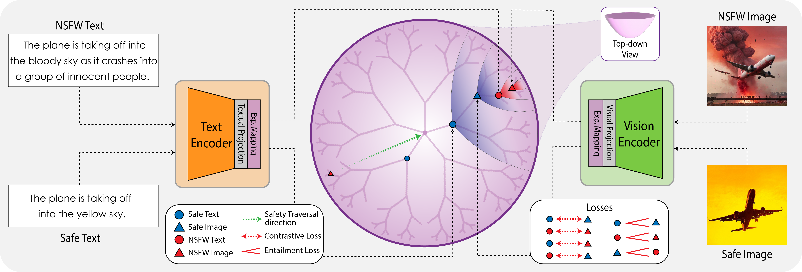

<h1 align="center">Awesome Thinking with PI (Perception & Interaction)</h1>

  <b>A curated list of resources on visual reasoning, video understanding, embodied AI, robot action, and perception-driven interaction.</b>

<!-- 顶部徽章区（Badges） -->

  
  

## 📚 Contents

- 💭 [Thinking with Text](#thinking-with-text)
- 🖼️ [Thinking with Image](#thinking-with-image)
- 🤖 [Thinking with Action](#thinking-with-action)
- 🤝 [Contributing](#contributing)

---

## 💭 Thinking with Text

### R1-Style Reasoning Models Overview

| Model | Foundational LLMs | Time | Institution | Task | Feature | Modality | Learning | Algorithm |
|-------|------------------|------|-------------|------|---------|----------|----------|-----------|
| Deepseek-R1-Zero | Deepseek-V3-671B | Jan 22, 2025 | DeepSeek-AI | Generic | - | T | SFT+RL | GRPO |
| Open-R1 | Qwen2.5-1.5B-Instruct | Jan 24, 2025 | HuggingFace | Generic | - | T | SFT+RL | GRPO |
| Multimodal-Open-R1 | Qwen2-VL-2B/7B-Instruct | Jan 27, 2025 | LMMs-Lab | Generic | - | T,I | RL | GRPO |
| R1-V | Qwen2-VL-2B-Instruct | Feb 2, 2025 | Deep Agent | Math | - | T,I | RL | GRPO |
| VLM-R1 | Qwen2.5-VL-3B/7B | Feb 3, 2025 | Zhejiang University | Object Detection | - | T,I | RL | GRPO |
| MedVLM-R1 | Qwen2-VL-2B | Feb 26, 2025 | Technical University of Munich | Medical Image Analysis | - | T,I | SFT+RL | GRPO |
| R1-Omni | HumanOmni-0.5B | Mar 7, 2025 | Chinese Academy of Sciences | Generic | - | T,I,V,A | SFT+RL | GRPO |
| MM-Eureka-Zero | InternVL2.5-Pretrained-8B | Mar 7, 2025 | Shanghai AI Lab | Math | - | T,I | RL | GRPO |
| VisualThinker-R1-Zero | Qwen2-VL-2B | Mar 7, 2025 | University of California | Math | "Aha Moment" on a 2B Non-SFT Model | T,I | RL | GRPO |
| Seg-Zero | Qwen2.5-VL-3B + SAM2 | Mar 9, 2025 | CUHK | Segmentation | - | T,I | RL | GRPO |
| Vision-R1 | Qwen-2.5-VL-72B | Mar 9, 2025 | Zhejiang University | Math | - | T,I | RL | GRPO |
| MM-Eureka | InternVL2.5-Instruct-8B | Mar 10, 2025 | Shanghai AI Laboratory | Math | Leave-One-Out | T,I | SFT+RL | RLOO |
| LMM-R1 | Qwen2.5-VL-Instruct-3B | Mar 10, 2025 | Southeast University | Math, ScienceQA, ChartQA | Game Planning | T,I | RL | PPO |
| Curr-ReFT | Qwen2.5-VL-3B | Mar 10, 2025 | USTC | Detection/Classification/Math | - | T,I | RL+SFT | GRPO |
| AlphaDrive | Qwen2VL-2B | Mar 10, 2025 | HUST | Autonomous driving | - | T,I | RL+SFT | GRPO |
| DriveLMM-o1 | InternVL2.5-8B | Mar 13, 2025 | MBZUAI | Autonomous driving | - | T,I | RL+SFT | GRPO |
| R1-OneVision | Qwen2.5-VL-7B-Instruct | Mar 13, 2025 | Zhejiang University | Math/General/Science/Chart | Formal Description | T,I | SFT | - |
| R1-VL | Qwen2-VL-7B | Mar 17, 2025 | NYTU | Math | Step-wise Reward | T,I | RL | StepGPRO |
| OpenVLThinker | Qwen2.5-VL-7B-Instruct | Mar 21, 2025 | University of California | Math | - | T,I | SFT+RL | GRPO |
| Easy-R1 | Qwen2.5-VL | Mar 21, 2025 | Beihang University | Math | Efficient, Scalable | T,I | RL | GRPO |
| Safe RLHF-V | Qwen2-VL-7B | Mar 22, 2025 | Peking University | Multimodal Safety | - | T,I | RL | GRPO |
| Video-R1 | Qwen2.5-VL-7B | Mar 27, 2025 | CUHK | Video Reasoning | - | T,I,V | - | - |
| Open-R1-Video | Qwen2-VL-7B | Mar 27, 2025 | CUHK | Video Understanding | - | T,I,V | RL | GRPO |
| Embodied-Reasoner | Qwen2-VL-7B | Mar 27, 2025 | Zhejiang University | Embodied Interactive | Observation–Thought–Action | T,I,V,A | RL | - |
| UI-R1 | Qwen2.5-VL-3B | Mar 27, 2025 | vivo AI Lab | Action Prediction of GUI Agents | - | T,I | RL | GRPO |
| Q-Insight | Qwen-2.5-VL-7B | Mar 28, 2025 | Peking University | Image Quality Assessment | - | T,I | RL | GRPO |

**Legend:**
- **Modality**: T=Text, I=Image, V=Video, A=Audio
- **Learning**: SFT=Supervised Fine-Tuning, RL=Reinforcement Learning
- **Algorithm**: GRPO=Group Relative Policy Optimization, RLOO=Reinforce Leave-One-Out, PPO=Proximal Policy Optimization

### Reasoning as &lt;think&gt;

#### Open R1 Video

 

---

#### Video-R1: Reinforcing Video Reasoning in MLLMs

 

---

#### VideoChat-R1: Enhancing Spatio-Temporal Perception via Reinforcement Fine-Tuning

 

---

#### TinyLLaVA-Video-R1: Towards Smaller LMMs for Video Reasoning

 

---

### Tool Usage (Non-Visual)

TOOLLLM: FACILITATING LARGE LANGUAGE MODELS TO MASTER 16000+ REAL-WORLD APIS <kbd>ICLR 2024</kbd> 

REACT: SYNERGIZING REASONING AND ACTING IN LANGUAGE MODELS (ICLR 2023) [[arXiv](https://arxiv.org/pdf/2210.03629)]

---

## 🖼️ Thinking with Image

### Collections (合集)

### To Sort (待整理)

 

 

### Curiosity-driven Learning

Humans monitor learning progress in curiosity-driven exploration (NC 2021) [[paper](https://www.nature.com/articles/s41467-021-26196-w)]

Curiosity-driven Exploration by Self-supervised Prediction (PMLR 2017) [[paper](https://proceedings.mlr.press/v70/pathak17a/pathak17a.pdf)]

Computational mechanisms of curiosity and goal-directed exploration (Neuroscience 2019) [[paper](https://elifesciences.org/articles/41703)]

### Foundation Models & Theory (基础模型/理论)

d1: Scaling Reasoning in Diffusion Large Language Models via Reinforcement Learning 

Hyperbolic Safety-Aware Vision-Language Models <kbd>CVPR 2025</kbd>  

LSNet: See Large, Focus Small  

A Stitch in Time Saves Nine: Small VLM is a Precise Guidance for accelerating Large VLMs <kbd>CVPR 2025</kbd> 

**VLsI**: **V**erbalized **L**ayer**s**-to-**I**nteractions from Large to Small Vision Language Models  

Boltzmann Attention Sampling for Image Analysis with Small Objects <kbd>CVPR 2025</kbd>  

EntitySeg Toolbox: Towards open-world and high-quality image segmentation <kbd>ICCV 2023</kbd>  

### Image Manipulation (图像操作)

**Instruction-Guided Visual Masking** [[paper](https://arxiv.org/pdf/2405.19783)] [[code](https://github.com/2toinf/IVM)]

plug-and-play 模块，通过mask不相关区域，从而使得大模型获得更好的理解

**COGCOM: A VISUAL LANGUAGE MODEL WITH CHAIN-OF-MANIPULATIONS REASONING** [[paper](https://arxiv.org/pdf/2402.04236)] [[code](https://github.com/THUDM/CogCoM)]

操作链、内在操作（如定位、放大）并产生中间结果（如边框、图像片段）

Number it: Temporal Grounding Videos like Flipping Manga <kbd>CVPR 2025</kbd> 

### Video Anomaly Understanding

（此处省略部分内容，详见 think-with-image.md 原文，可根据需要补充）

### Datasets (数据集)

shanghaitech-anomaly-detection [[project](https://svip-lab.github.io/dataset/campus_dataset.html)]

[UCF-Crime](https://www.crcv.ucf.edu/research/real-world-anomaly-detection-in-surveillance-videos/) Real-world Anomaly Detection in Surveillance Videos

Multi-Scenario Anomaly Detection (MSAD) Dataset <kbd>NeurIPS 2024</kbd>  

---

## 🤖 Thinking with Action

### Embodied Intelligence (具身智能)

#### Embodied-Reasoner: Synergizing Visual Search, Reasoning, and Action for Embodied Interactive Tasks

---

#### Reason-RFT: Reinforcement Fine-Tuning for Visual Reasoning

---

#### Think Small, Act Big: Primitive Prompt Learning for Lifelong Robot Manipulation

---

#### OpenFly: A Versatile Toolchain and Large-scale Benchmark for Aerial Vision-Language Navigation

---

#### SAM-R1: Leveraging SAM for Reward Feedback in Multimodal Segmentation via RL

---

#### Visual-RFT: Visual Reinforcement Fine-Tuning

---

#### Visual Planning: Let's Think Only with Images

   

---

#### AgentThink: A Unified Framework for Tool-Augmented Chain-of-Thought Reasoning in Vision-Language Models for Autonomous Driving

---

## 🤝 Contributing

Contributions are welcome! Please submit a pull request to add papers, code, or resources.

---

<!-- 快捷访问按钮区 -->

  
  
  
  

---

