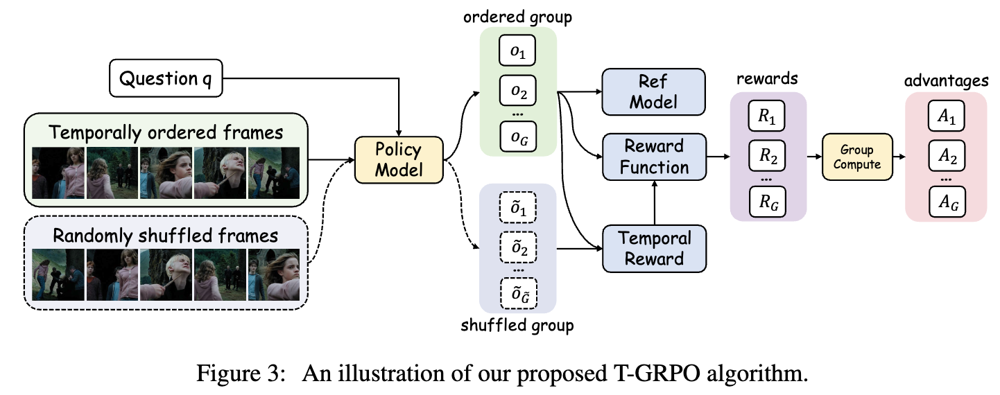
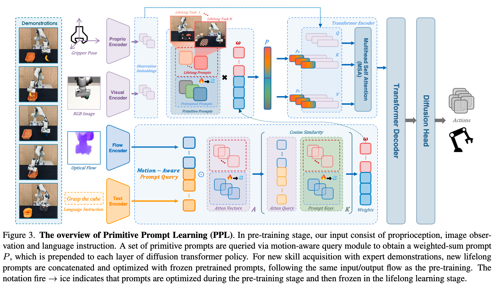
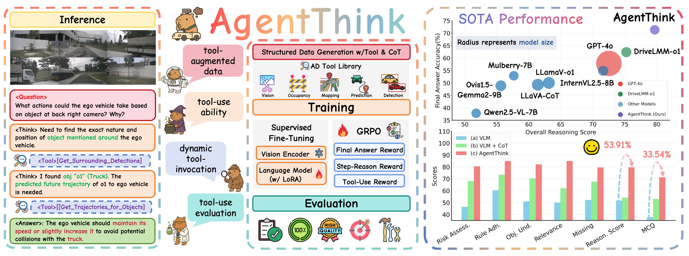

<h1 align="center">Awesome Thinking with PI (<u>P</u>erception & <u>I</u>nteraction)</h1>

  <b>A curated list of resources on visual reasoning, video understanding, embodied AI, robot action, and perception-driven interaction.</b>

<!-- Top badges -->

  
  
  
  

## 📚 Contents

- 📖 [Surveys](#surveys)
- 📊 [Benchmarks and Datasets](#benchmarks-and-datasets)
 - 💭 [Thinking with Language (Symbolic-level)](#thinking-with-language-symbolic-level)
 - 🖼️ [Thinking with Images (Perceptual-level)](#thinking-with-images-perceptual-level)
 - 🤖 [Thinking with Action (Embodied-level)](#thinking-with-action-embodied-level)
 - 🛠️ [Tutorials and Tooling](#tutorials-and-tooling)

---

## 📖 Surveys

### Related Awesome Lists

 — Visual-only reasoning with images (papers + code).
 — Broad visual thinking and perception resources.

---

## 📊 Benchmarks and Datasets

shanghaitech-anomaly-detection [[project](https://svip-lab.github.io/dataset/campus_dataset.html)] — Campus surveillance anomaly set; classic weakly supervised benchmark.

[UCF-Crime](https://www.crcv.ucf.edu/research/real-world-anomaly-detection-in-surveillance-videos/) — Real-world surveillance anomaly dataset with long untrimmed videos.

Multi-Scenario Anomaly Detection (MSAD) Dataset (NeurIPS 2024)   — Large-scale, multi-scene anomaly benchmark.

### Metrics & Evaluation

- Coming soon: common tasks, metrics, and evaluation protocols.

---

## 💭 Thinking with Language (Symbolic-level)

### R1-Style Reasoning Models Overview

<!-- table begins -->

| Model | Foundational LLMs | Time | Institution | Task | Feature |
|-------|------------------|------|-------------|------|---------|
| Deepseek-R1-Zero  | Deepseek-V3-671B | Jan 22, 2025 | DeepSeek-AI | Generic | - |
| Open-R1  | Qwen2.5-1.5B-Instruct | Jan 24, 2025 | HuggingFace | Generic | - |
| Multimodal-Open-R1  | Qwen2-VL-2B/7B-Instruct | Jan 27, 2025 | LMMs-Lab | Generic | - |
| R1-V  | Qwen2-VL-2B-Instruct | Feb 2, 2025 | Deep Agent | Math | - |
| VLM-R1  | Qwen2.5-VL-3B/7B | Feb 3, 2025 | Zhejiang University | Object Detection | - |
| MedVLM-R1 | Qwen2-VL-2B | Feb 26, 2025 | Technical University of Munich | Medical Image Analysis | - |
| R1-Omni  | HumanOmni-0.5B | Mar 7, 2025 | Chinese Academy of Sciences | Generic | - |
| MM-Eureka-Zero | InternVL2.5-Pretrained-8B | Mar 7, 2025 | Shanghai AI Lab | Math | - |
| VisualThinker-R1-Zero  | Qwen2-VL-2B | Mar 7, 2025 | University of California | Math | "Aha Moment" on a 2B Non-SFT Model |
| Seg-Zero  | Qwen2.5-VL-3B + SAM2 | Mar 9, 2025 | CUHK | Segmentation | - |
| Vision-R1  | Qwen-2.5-VL-72B | Mar 9, 2025 | Zhejiang University | Math | - |
| MM-Eureka | InternVL2.5-Instruct-8B | Mar 10, 2025 | Shanghai AI Laboratory | Math | Leave-One-Out, RLOO |
| LMM-R1 | Qwen2.5-VL-Instruct-3B | Mar 10, 2025 | Southeast University | Math, ScienceQA, ChartQA | Game Planning, PPO |
| Curr-ReFT | Qwen2.5-VL-3B | Mar 10, 2025 | USTC | Detection/Classification/Math | - |
| AlphaDrive | Qwen2VL-2B | Mar 10, 2025 | HUST | Autonomous driving | - |
| DriveLMM-o1  | InternVL2.5-8B | Mar 13, 2025 | MBZUAI | Autonomous driving | - |
| R1-OneVision  | Qwen2.5-VL-7B-Instruct | Mar 13, 2025 | Zhejiang University | Math/General/Science/Chart | Formal Description |
| R1-VL  | Qwen2-VL-7B | Mar 17, 2025 | NYTU | Math | Step-wise Reward |
| OpenVLThinker  | Qwen2.5-VL-7B-Instruct | Mar 21, 2025 | University of California | Math | - |
| Easy-R1 | Qwen2.5-VL | Mar 21, 2025 | Beihang University | Math | Efficient, Scalable |
| Safe RLHF-V | Qwen2-VL-7B | Mar 22, 2025 | Peking University | Multimodal Safety | - |
| Video-R1  | Qwen2.5-VL-7B | Mar 27, 2025 | CUHK | Video Reasoning | - |
| Open-R1-Video  | Qwen2-VL-7B | Mar 27, 2025 | CUHK | Video Understanding | - |
| Embodied-Reasoner  | Qwen2-VL-7B | Mar 27, 2025 | Zhejiang University | Embodied Interactive | Observation–Thought–Action |
| UI-R1 | Qwen2.5-VL-3B | Mar 27, 2025 | vivo AI Lab | Action Prediction of GUI Agents | - |
| Q-Insight  | Qwen-2.5-VL-7B | Mar 28, 2025 | Peking University | Image Quality Assessment | - |

Note: A small GitHub badge next to a model name links to its confirmed repository. If no badge is shown, the official repo is pending or unverified.

<!-- Legend removed as Modality column was dropped -->

<!-- table ends -->

### Reasoning as &lt;think&gt;

#### Open R1 Video

 

---

#### Video-R1: Reinforcing Video Reasoning in MLLMs

 

---

#### VideoChat-R1: Enhancing Spatio-Temporal Perception via Reinforcement Fine-Tuning

 

---

#### TinyLLaVA-Video-R1: Towards Smaller LMMs for Video Reasoning

 

---

 

## 🖼️ Thinking with Images (Perceptual-level)

### 理论部分

### 为什么要用工具

### Collections

### To Sort

 

 

### Curiosity-driven Learning

Humans monitor learning progress in curiosity-driven exploration (NC 2021) [[paper](https://www.nature.com/articles/s41467-021-26196-w)]

Curiosity-driven Exploration by Self-supervised Prediction (PMLR 2017) [[paper](https://proceedings.mlr.press/v70/pathak17a/pathak17a.pdf)]

Computational mechanisms of curiosity and goal-directed exploration (Neuroscience 2019) [[paper](https://elifesciences.org/articles/41703)]

### Foundation Models & Theory

d1: Scaling Reasoning in Diffusion Large Language Models via Reinforcement Learning 

Hyperbolic Safety-Aware Vision-Language Models <kbd>CVPR 2025</kbd>  

LSNet: See Large, Focus Small  

A Stitch in Time Saves Nine: Small VLM is a Precise Guidance for accelerating Large VLMs <kbd>CVPR 2025</kbd> 

**VLsI**: **V**erbalized **L**ayer**s**-to-**I**nteractions from Large to Small Vision Language Models  

Boltzmann Attention Sampling for Image Analysis with Small Objects <kbd>CVPR 2025</kbd>  

EntitySeg Toolbox: Towards open-world and high-quality image segmentation <kbd>ICCV 2023</kbd>  

### Image Manipulation

**Instruction-Guided Visual Masking** [[paper](https://arxiv.org/pdf/2405.19783)] [[code](https://github.com/2toinf/IVM)]

Plug-and-play module: mask irrelevant regions to enable better understanding by large models.

**COGCOM: A VISUAL LANGUAGE MODEL WITH CHAIN-OF-MANIPULATIONS REASONING** [[paper](https://arxiv.org/pdf/2402.04236)] [[code](https://github.com/THUDM/CogCoM)]

Chain of manipulations; intrinsic operations (e.g., locate, zoom) that produce intermediate outputs (e.g., bounding boxes, image patches).

Number it: Temporal Grounding Videos like Flipping Manga <kbd>CVPR 2025</kbd> 

### Video Anomaly Understanding

(Content omitted here. See the original think-with-image.md for details and add as needed.)

 

## 🤖 Thinking with Action (Embodied-level)

### Embodied Intelligence

#### Embodied-Reasoner: Synergizing Visual Search, Reasoning, and Action for Embodied Interactive Tasks

---

#### Reason-RFT: Reinforcement Fine-Tuning for Visual Reasoning

---

#### Think Small, Act Big: Primitive Prompt Learning for Lifelong Robot Manipulation

---

#### OpenFly: A Versatile Toolchain and Large-scale Benchmark for Aerial Vision-Language Navigation

---

#### SAM-R1: Leveraging SAM for Reward Feedback in Multimodal Segmentation via RL

---

#### Visual-RFT: Visual Reinforcement Fine-Tuning

---

#### Visual Planning: Let's Think Only with Images

   

---

#### AgentThink: A Unified Framework for Tool-Augmented Chain-of-Thought Reasoning in Vision-Language Models for Autonomous Driving

---

## 🛠️ Tutorials and Tooling

强化学习算法改进

实现
swift agent-rl

TOOLLLM: Facilitating Large Language Models to Master 16000+ Real-World APIs <kbd>ICLR 2024</kbd> 

ReAct: Synergizing Reasoning and Acting in Language Models <kbd>ICLR 2023</kbd> 

